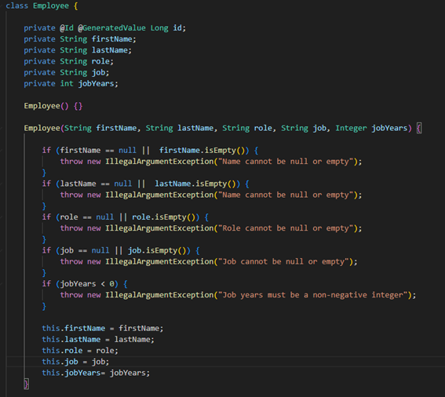
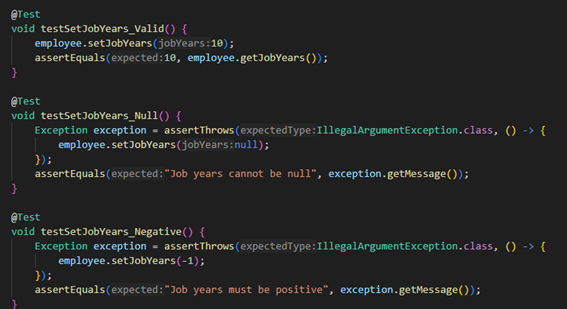
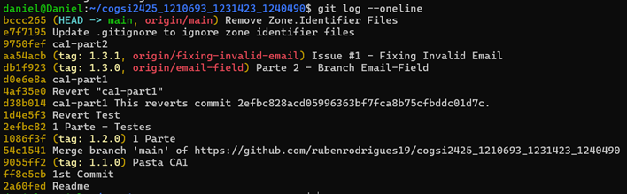
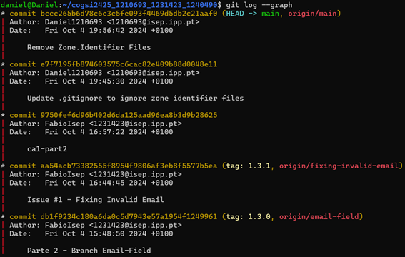
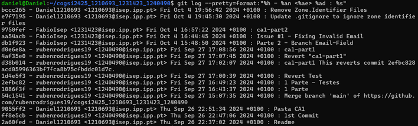
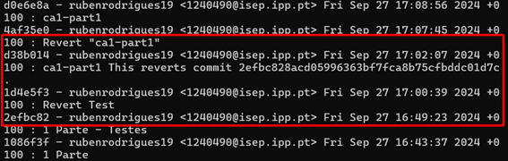
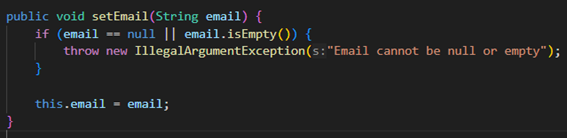
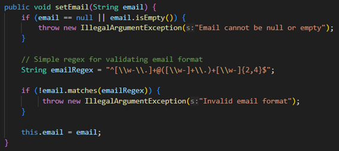
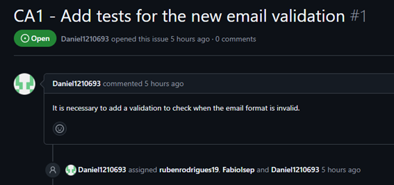
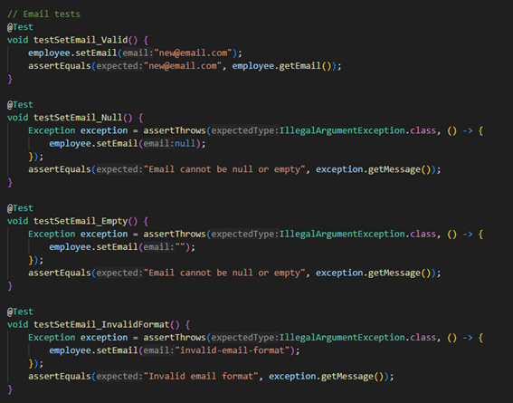

# Introdução

Este projeto, desenvolvido no âmbito do Mestrado em Engenharia Informática do Instituto Superior de Engenharia do Porto, visa explorar o controlo de versões através da utilização do Git, uma ferramenta essencial na gestão de código em projetos colaborativos. Dividido em duas partes, o trabalho foca-se inicialmente na utilização da branch principal, sem ramificações, para a implementação de uma funcionalidade básica. Na segunda fase, é introduzida a criação e a gestão de branches para o desenvolvimento de novas funcionalidades e correção de erros.
Adicionalmente, o projeto desafia os alunos a proporem uma solução tecnológica alternativa ao Git, analisando comparativamente as suas características e implementando um design que possa cumprir os requisitos apresentados.
Os resultados deste trabalho serão documentados num ficheiro readme.md no repositório do grupo, com uma explicação detalhada dos passos e decisões tomadas durante o desenvolvimento, facilitando a sua reprodutibilidade.

# Tutorial
## 1º Passo - Criar o Repositório
Como ponto inicial, o primeiro objetivo é a criação do repositório para o desenvolvimento do projeto.

    git clone https://github.com/rubenrodrigues19/cogsi2425_1210693_1231423_1240490.git

Este comando faz uma cópia do repositório remoto especificado no GitHub para o teu computador, criando uma cópia local do projeto.

    echo " cogsi2425_1210693_1231423_1240490" >> README.md

Este comando adiciona o texto "cogsi2425_1210693_1231423_1240490" ao ficheiro README.md. Se o ficheiro não existir, ele será criado automaticamente. O README.md serve como um documento principal para descrever o projeto.

    git init

Inicializa um novo repositório Git no diretório atual, tornando-o um repositório Git local (caso ainda não tenha sido inicializado).
  
    git add README.md

Adiciona o ficheiro README.md à "staging area", preparando-o para ser incluído no próximo commit.

    git commit -m "Readme"

Este comando grava as mudanças registadas na "staging area" com uma mensagem de commit, neste caso, "Readme", descrevendo a alteração feita.

    git branch -M main

Muda o nome da branch atual (que, por defeito, pode ser master) para main, estabelecendo-a como a branch principal do repositório.

    git push -u origin main

Envia as mudanças locais (o commit feito anteriormente) para o repositório remoto (no GitHub), especificando a branch main como a branch para envio padrão no futuro.

## 2º Passo – Criar a Pasta CA1

Após se concluir o primeiro passo, o segundo objetivo é criar uma pasta (CA1) onde irá ser copiado e armazenado uma versão do projeto Building REST

    cd /caminho/para/o/repositório/local

Navega até o diretório local onde o repositório Git está armazenado. Este é o local onde a nova pasta CA1 será criada.

    mkdir CA1

Cria uma nova pasta chamada CA1 dentro do repositório local. Esta pasta será usada para organizar os ficheiros relacionados ao primeiro trabalho da disciplina.

    cp /caminho/de/origem/* /caminho/de/destino/CA1

Copia todos os ficheiros da origem especificada para a nova pasta CA1.
    
    git status

Exibe o estado atual do repositório, mostrando quais ficheiros foram modificados ou adicionados e estão prontos para levarem commit, ou se há ficheiros não rastreados.

    git add . 

Adiciona todos os ficheiros e alterações na pasta atual (neste caso, incluindo a nova pasta CA1 e os ficheiros dentro dela) à "staging area", preparando-os para o commit.

    git commit -m "Pasta CA1"

Grava um snapshot do estado atual dos ficheiros adicionados, com uma mensagem de commit descrevendo as alterações feitas. Aqui, a mensagem indica que a pasta CA1 foi criada e adicionada.
    
    git push -u origin main

Envia as alterações locais para o repositório remoto (GitHub), na branch main. O parâmetro -u define origin/main como o destino padrão para futuros git push, facilitando o envio de futuras alterações.

## 3º Passo - Criar Tag

Neste passo, o objetivo é desenvolver uma tag para marcar a primeira versão do projeto

    git tag 1.1.0

Este comando cria uma nova tag chamada 1.1.0 no repositório local. As tags são usadas para marcar versões específicas de um projeto, servindo como referências importantes. Neste caso, a tag 1.1.0 indica que esta versão é a primeira grande versão.

    git push origin 1.1.0

Este comando envia a tag 1.1.0 para o repositório remoto (GitHub). Assim, a tag criada localmente será também visível e acessível para qualquer pessoa que tenha acesso ao repositório remoto, marcando esta versão como um ponto importante do desenvolvimento.

    git fetch –tags

Este comando faz o download de todas as tags do repositório remoto para o repositório local. Garante que todas as tags remotas sejam atualizadas e disponíveis localmente.

## 4º Passo – Criação da Nova Feature (jobYears)

Ao longo deste ponto o objetivo é desenvolver a feature jobYears, para isso, deve ser adicionado um novo campo para registar os anos de serviço do empregado na empresa (por exemplo, jobYears). O suporte para este novo campo deve ser implementado, garantindo que apenas valores inteiros são permitidos. Além disso, devem ser criados testes unitários para validar a criação de empregados e verificar os seus atributos, assegurando que não há valores nulos ou vazios. Após a conclusão e testagem da nova funcionalidade, o código deve ser comprometido e enviado, seguido da criação de uma nova tag (ex.: v1.2.0).

Excerto do código utilizado para o desenvolvimento da feature.

Excerto do código dos testes unitários.

    git commit -m “1st Commit”
    git push -u origin main
    git tag -a 1.2.0 -m "Versão 1.2.0. - Parte 1"

Commit e implementação da Tag 1.2.0

## 7º Passo – Git Log

Neste ponto podemos ver os diferentes tipos de log e os seus outputs.
    
    git log –oneline

    git log --graph
    

    git log –pretty=format:”%h - %an <%ae> %ad : %s”
    

## 8º Passo – Revert

Neste passo, objetivo é voltar atrás um commit já feito criando assim um revert.

    git commit -m "Revert Test"
    git revert 2efbc828acd05996363bf7fca8b75cfbddc01d7c

O comando git revert 2efbc828acd05996363bf7fca8b75cfbddc01d7c reverte as alterações feitas no commit especificado pelo hash 2efbc828acd05996363bf7fca8b75cfbddc01d7c.
    
    git revert d38b0149c7b5c308630141427abd5bd141de5190 -m "Wrong Revert 1"
    git revert 1d4e5f318f9a44f97714893e400cc942c3c650f8

> **Nota**: Neste ponto executamos o comando revert mais vezes do que as necessárias, pois executamos incorretamente o comando, criando um revert que não era o nosso desejado, para corrigir o problema, fizemos outra sequencia de revert, a primeira para voltar ao ponto inicial e a segunda para irmos para o ponto desejado.

## 9º Passo – Criação de uma Nova Branch

Neste tópico, o objetivo é a criação de uma branch principal (main) que deve ser utilizada para publicar versões estáveis da aplicação "Building REST services with Spring". Cada nova funcionalidade deve ser desenvolvida numa branch com o nome da respetiva funcionalidade. As funcionalidades, após serem testadas, devem ser integradas na branch principal (main) para o lançamento de uma nova versão da aplicação.

    git status
    git add .
    
Verificar os ficheiros modificados e adicioná-los ao commit

    git branch “Branch Email-Field”

Este comando é utilizado para criar, listar ou eliminar branches no Git. No caso deste comando específico, é usado para criar uma nova branch.

    git commit -m 'Parte 2 - Branch Email-Field'
    git push --set-upstream origin email-field

Este comando envia a branch local email-field para o repositório remoto (GitHub), criando a branch também no GitHub, e define a branch remota origin/email-field como o "upstream" para a branch local. Isso significa que, no futuro, qualquer git push ou git pull na branch email-field será automaticamente associado a essa branch remota.

    git checkout main

Este comando muda para a branch main no repositório local. Isso permite preparar a branch principal para fundir as alterações da branch email-field.

    git merge email-field

Este comando combina as alterações feitas na branch email-field com a branch atual (que neste caso é a main). Isso integra todas as alterações desenvolvidas na branch email-field à branch principal, permitindo que as novas funcionalidades ou correções sejam incorporadas ao projeto principal.
    
    git push
    git tag 1.3.0
    git push origin 1.3.0

Excerto de código utilizado para o desenvolvimento do email

## 10º Passo – Validações para o email

Neste ponto, deve ser adicionada a funcionalidade de um campo de email para os empregados, juntamente com a criação de testes unitários para validar a criação de empregados e a verificação dos seus atributos (por exemplo, garantir que não há valores nulos ou vazios). Após a conclusão e testagem da nova funcionalidade, o código deve ser comprometido e integrado na branch principal, seguido da criação de uma nova tag (ex.: v1.3.0).

Excerto de código utilizado para o desenvolvimento do email

    git checkout -b fixing-invalid-email

##### Foi criado um Issue #1 para resolver o problema de validação do e-mail

Testes unitários para validação do email

    git commit –m “Issue #1 - Fixing Invalid Email”
    git push --set-upstream fixing-invalid-email
    git checkout main
    git merge fixing-invalid-email
    git push
    git tag 1.3.1
    git push origin 1.3.1
    
Comandos finais para fazer o último commit e criação da tag 1.3.1

# Outros comandos

Neste tópico abordamos outros comandos que utilizamos para a resolução do nosso projeto 

    git ignore
    *.Zone.Identifier

Adicionamos ao nosso git ignore um comando para ignorar os ficheiros Zone.Identifier

    git config --global user.email "exemplo@isep.ipp.pt"

Configura o endereço de e-mail associado aos commits. Este e-mail será exibido nos registos de histórico de versões do Git.

    git config --global user.name "Aluno"

Configura o nome de utilizador que será associado aos commits. Tal como o e-mail, o nome aparecerá no histórico de commits.

    find . -name "*.Identifier" -type f

Este comando procura todos os ficheiros do tipo .Identifier. 

    find . -name "*.Identifier" -type f -delete

Este comando elimina todos os ficheiros do tipo .Identifier. 

> **Nota**: Utilizamos estes comandos, pois o Windows e o WLS criaram vários ficheiros Zone.Identifier que não tinham utilidade para o projeto. 

# Alternativas

## Git    Descrição:

O Git é um sistema de controlo de versões distribuído, criado por Linus Torvalds em 2005. Permite que cada programador tenha uma cópia completa do repositório no seu sistema local, incluindo todo o histórico de revisões. O Git destaca-se pela sua eficiência em termos de velocidade e flexibilidade, especialmente em projetos de grande escala.

### Vantagens:

•	**Distribuído:** Cada programador tem uma cópia completa do histórico, permitindo que trabalhem offline e façam commits localmente.  
•	**Velocidade:** As operações locais (commits, branches, merges) são extremamente rápidas.  
•	**Branching poderoso:** Facilita a criação e fusão de branches, promovendo fluxos de trabalho como Git Flow e GitHub Flow.  
•	**Popularidade:** O Git é amplamente utilizado e tem uma grande comunidade de suporte, além de ferramentas populares como GitHub, GitLab e Bitbucket.  
•	**Flexibilidade:** Oferece controlo granular sobre o histórico de commits e permite reescrevê-lo (rebase, amend).

### Desvantagens:

•	**Curva de aprendizagem:** O Git pode ser confuso para iniciantes, devido à sua complexidade e às muitas opções de comandos.  
•	**Histórico reescrevível:** A possibilidade de reescrever o histórico pode ser perigosa se usada incorretamente, causando perda de dados.  
•	**Gestão de ficheiros grandes:** Embora existam ferramentas como o Git LFS (Large File Storage), o Git não é ideal para lidar com ficheiros muito grandes.

#

## Subversion (SVN)    Descrição:

Subversion, também conhecido como SVN, é um sistema de controlo de versões centralizado, criado em 2000 como sucessor do CVS. Utiliza um servidor central para armazenar o repositório, e os programadores fazem checkouts de cópias locais dos ficheiros para trabalhar.

### Vantagens:

•	**Simplicidade:** O SVN tem uma curva de aprendizagem mais suave, sendo mais fácil para principiantes.  
•	**Controlo centralizado:** O modelo centralizado pode ser mais simples para equipas que preferem um único ponto de referência e controlo sobre o código.  
•	**Histórico linear:** O histórico no SVN é sempre linear, sem a complexidade de branches distribuídas.  
•	**Bom suporte para ficheiros grandes:** O SVN lida melhor com ficheiros grandes e binários, já que estes não precisam de ser descarregados completamente em cada atualização.

### Desvantagens:

•	**Centralizado:** Os programadores dependem de um servidor central para a maioria das operações, o que pode ser problemático em caso de falta de ligação à internet.  
•	**Desempenho:** As operações de rede são mais lentas em comparação com sistemas distribuídos, pois requerem comunicação constante com o servidor.  
•	**Branching mais complexo:** Embora seja possível criar branches, o processo é mais lento e menos intuitivo do que no Git ou Mercurial.

#

## Mercurial (Hg)    Descrição:

Mercurial, também conhecido como Hg, é outro sistema de controlo de versões distribuído, lançado em 2005, na mesma época que o Git. Foi projetado para ser fácil de usar, oferecendo algumas das mesmas vantagens de um sistema distribuído.

### Vantagens:

•	**Distribuído:** Tal como o Git, o Mercurial permite que os programadores tenham uma cópia completa do repositório nos seus sistemas locais.  
•	**Curva de aprendizagem:** O Mercurial é considerado mais simples e amigável para principiantes em comparação com o Git.  
•	**Velocidade:** O desempenho do Mercurial é comparável ao do Git, em termos de operações locais e eficiência.  
•	**Histórico imutável:** O histórico de commits no Mercurial é mais restrito e não pode ser reescrito facilmente, o que oferece maior segurança para equipas que preferem um histórico claro e imutável.

### Desvantagens:

•	**Menor popularidade:** O Mercurial tem uma comunidade menor e menos ferramentas de integração comparado com o Git.  
•	**Branching:** Embora suporte branching, não é tão avançado ou flexível quanto o Git.  
•	**Menor flexibilidade:** O Mercurial prioriza a simplicidade, oferecendo menos opções de personalização para utilizadores avançados.

#

