# Introdução

Este projeto, tem como objetivo explorar a automação de builds utilizando o Gradle. O trabalho está dividido em duas partes: na primeira, focamo-nos na aplicação de conceitos básicos do Gradle através de um exemplo simples, como a criação de tarefas personalizadas e o controlo de versões com tags. Na segunda parte, a nossa tarefa é converter uma aplicação de serviços REST, originalmente desenvolvida com Maven, para Gradle, implementando novas funcionalidades e otimizando o processo de build.
Além disso, é-nos solicitado que apresentemos uma solução alternativa ao Gradle, analisando e comparando as suas funcionalidades e eficiência em relação à ferramenta original. Por fim, toda a documentação deste projeto, incluindo os passos seguidos e as decisões tomadas, será detalhada num ficheiro readme.md, armazenado no repositório do grupo, de forma a garantir a replicação do trabalho desenvolvido.
Os resultados deste trabalho serão documentados num ficheiro readme.md no repositório do grupo, com uma explicação detalhada dos passos e decisões tomadas durante o desenvolvimento, facilitando a sua reprodutibilidade.

# Tutorial

## Parte 1
### 1º Passo - Criação da Pasta CA2 e Part1

    mkdir CA2
    cd CA2
    mkdir Part1

### 2º Passo - Clone do Projeto

    git clone https://github.com/lmpnogueira/cogsi2425.git
    rm .git

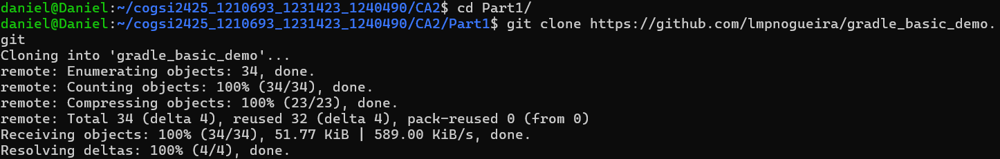
 Print Part1

### 3º Passo - Criação dos Issues

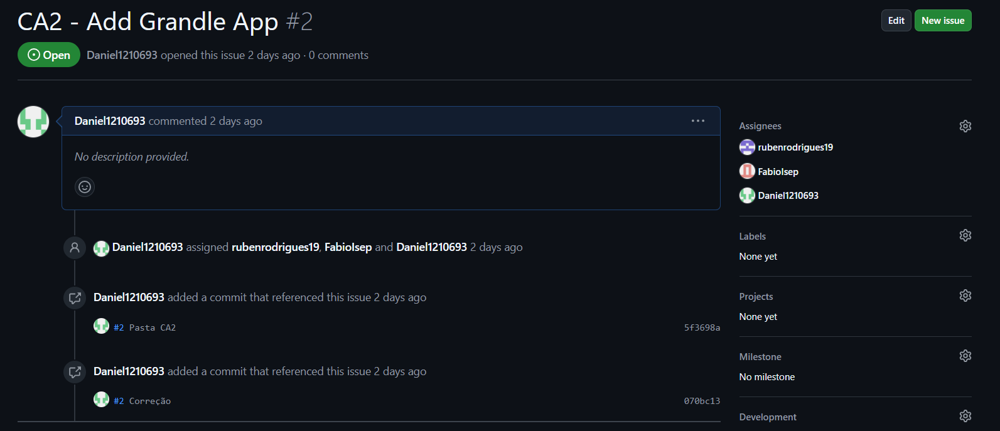

### 4º Passo - Criação de Tag CA2-1.1.0

    git tag ca2-1.1.0
    git tag

### <Após isso fica fizemos o primeiro commit>

    git add .
    git commit -m "Pasta CA2"
    git push -u origin main

### 5º Passo - Task para Executar o Server

    task runServer(type:JavaExec, dependsOn: classes) {
        group = "DevOps"
        description = "Launches chat server on 59001 port"
        classpath = sourceSets.main.runtimeClasspath
        mainClass = 'basic_demo.ChatServerApp'
        args '59001' 
    }

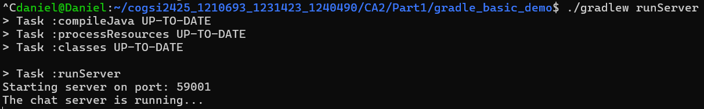

### 6º Passo - Testes Unitários
Dentro do directorio Part1/gradle_basic_demo/src

    mkdir test/java/basic_demo
    nano AppTest.java

Codigo para jogo

    package basic_demo;
    import static org.junit.Assert.assertNotNull;
    import org.junit.Test;
    public class AppTest {
        
        @Test
        public void testAppHasAGreeting() {
            App classUnderTest = new App();
            assertNotNull("app should have a greeting", classUnderTest.getGreeting());
        
        }
    }

### 7º Passo - Task Backup
Neste tópico desenvolve-mos código para 

    task backupSources(type: Copy) {
        group = "DevOps"
        description = "Backup of the sources of the application"
        from 'src'
        into 'backup/'
    }

Para além da task para cirar o backup, criamos tambem uma task para apagar o backup

    task deleteBackup(type: Delete) {
        delete 'backup' 
    }

Execução da task ./gradlew backupSources
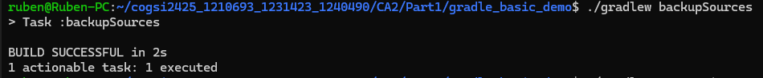

### 8º Passo - Task Zip

    task createZip(type: Zip) {
        group = "DevOps"
        description = "Zip archive of the sources of the application"
        from 'src'
        archiveFileName = 'zipfile.zip'
        destinationDirectory = file('backup/')
    }

Para além da task para cirar o zip, criamos tambem uma task para apagar o zip  

    task deleteZip(type: Delete) {
        delete file('backup/zipfile.zip')
    }   

Execução da task ./gradlew createZip
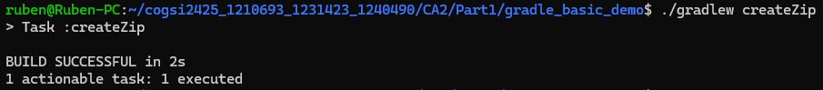

### 9º Passo - Tag Final

    git tag ca2-part1
    git push origin ca2-part1
    git fetch -tags

## Parte 2

### 1º Passo - Criação do Projeto Gradle
**Objetivo:** Num diretório vazio, utiliza o comando *gradle init* para criar um projeto Gradle.  
 - Substitui a pasta *src* pela da aplicação "Building REST services with Spring".

**Resolução:**  
Para resolver este objetivo criamos um directorio vazio chamado Part2 dentro da pasta CA2

    mkdir Part2

Dentro desse directorio executamos o comando

    gradle init

E selecionamos as seguintes opções

1. 1 "Application"
2. 1 "Java"
3. 17 (Java Version)
4. building-rest (Project Name)
5. 1 "Single application project"
6. 2 "Groovy"
7. 1 "JUnit 4"
8. yes (Generate Build Using new APIs and Behavior)

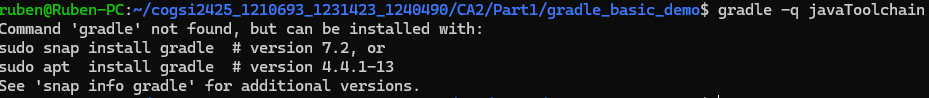

> **Nota:** Estas opções foram feitas com base nas ferramentas já usadas para a parte 1 do projeto, e com base no conforte com que temos nas mesmas.

### 2º Passo - Adição de Todos as Dependências e Plugins
**Objetivo:** Certifica-te de que todas as dependências e plugins necessários estão adicionados ao teu script de build do Gradle.  
 - Compila e executa a aplicação com `./gradlew bootRun`.  
 - Utiliza o teu navegador em [http://localhost:8080/employees](http://localhost:8080/employees).

### 3º Passo - Task de Zipar e Armazenar no Directório Backup
**Objetivo:** Criar uma tarefa personalizada que comprime (em formato zip) todo o código-fonte do projeto e o armazena num diretório de backup.
- Esta tarefa deve tratar tanto da cópia como da compressão do código-fonte, garantindo um processo de backup limpo.

**Resolução:** 
    
    task backupProject(type: Zip) {
        group = "Backup"
        description = "Zips the entire source code and stores it in a backup directory."

        from 'src'
        include '**/*'
        
        destinationDirectory = file("backups")
        
        archiveFileName = "source-backup-${new Date().format
        ('yyyy-MM-dd_HH-mm-ss')}.zip"
        
        doFirst {
            println "Cleaning backup directory and preparing for zipping the source code..."
            delete file("backups")
            mkdir file("backups")
        }
        
        doLast {
            println "Source code successfully backed up and stored in ${destinationDirectory.get().asFile.absolutePath}"
        }
    }

Esta tarefa do Gradle é projetada para compactar o código fonte localizado no diretório src, armazená-lo em um diretório de backup chamado backups, e nomear o arquivo ZIP de acordo com a data e hora atuais. Antes de compactar, ela limpa o diretório de backup anterior e cria um novo (doFirst), e ao final, informa que o backup foi realizado com sucesso (doLast).

**Resultado Final:**

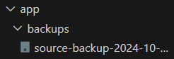

# PRINT COMMIT

### 4º Passo - Task do InstallDist
**Objetivo:** Criar uma tarefa personalizada que dependa da tarefa *installDist* e executar a aplicação utilizando os scripts de distribuição gerados.  
 - Define o script executável com base no sistema operativo.

**Resolução:**  
Como primeiro ponto foi criada uma branch e issue para trabalhar neste passo, para isso foram feitos os comandos:

    git branch "installDist"

Em seguida foi criado o código para a Task.

    task runDistApp(type: Exec){
        group = "Application"
        description = "Runs the application using the generated distribution scripts."

        dependsOn installDist

        def os = org.gradle.internal.os.OperatingSystem.current()
        
        def appDir = "$buildDir/install/${project.name}/bin"
        def execScript
        
        if (os.isWindows()) {
            execScript = "${appDir}/${project.name}.bat"
        } else {
            execScript = "${appDir}/${project.name}"
        }
        
        println "Running the application using: $execScript"
        executable = execScript
    }

A tarefa runDistApp é projetada para executar a aplicação usando os scripts de distribuição gerados pelo Gradle. 
Ela determina o sistema operativo para escolher o script apropriado a ser executado, garante que a aplicação esteja instalada antes de tentar executá-la e imprime na consola o comando que será executado.

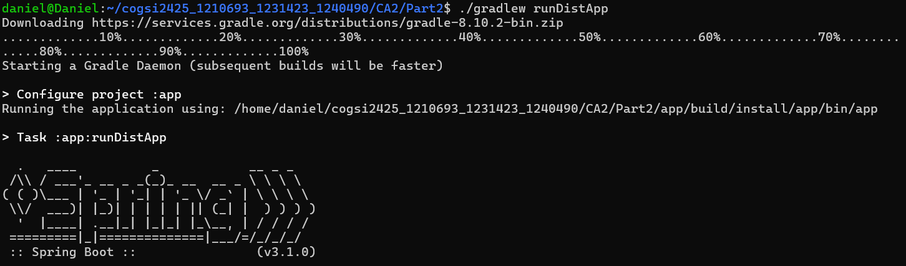

**Resultado:**

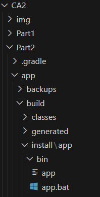

Por fim foi feito o devido commit e o merge da branch.  
E adicionada a respetiva tag.

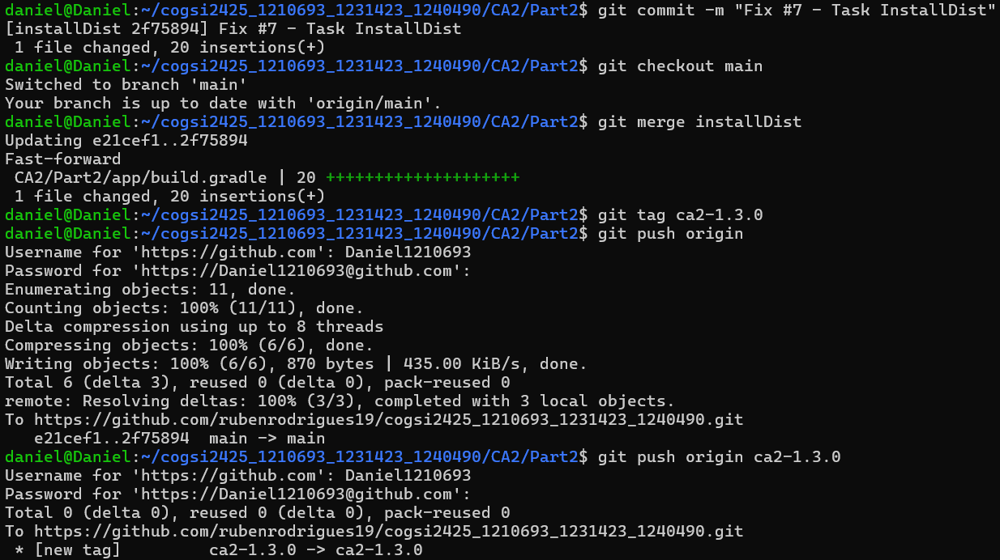

### 5º Passo - Task do Javadoc
**Objetivo:** Criar uma tarefa personalizada que dependa da tarefa *javadoc*, a qual gera a Javadoc para o teu projeto, e depois empacota a documentação gerada num ficheiro zip.

**Resolução:**  
Como primeiro ponto foi criada uma branch e issue para trabalhar neste passo, para isso foram feitos os comandos:

    git branch "javadoc"

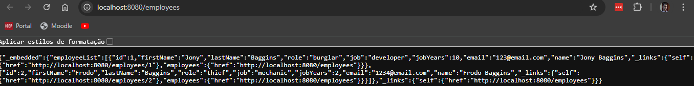

**Resultado:**

### 6º Passo - Testes Integração
**Objetivo:** Criar um novo conjunto de código-fonte para testes de integração.  
 - Adiciona um teste simples e as dependências e tarefas necessárias para executar o teste.

   

# Alternativas

## Gradle    Descrição:
Gradle é uma ferramenta moderna de automação de builds que usa uma DSL flexível baseada em Groovy ou Kotlin, focada em performance com suporte a builds incrementais e caching.

### Vantagens: 
 - Rápido
 - Flexível
 - Usa uma linguagem moderna (Groovy/Kotlin) 
 - Ideal para grandes projetos como Android

### Desvantagens: 
 - Curva de aprendizado mais alta
 - Documentação pode ter aspectos confusa

## Maven:
Maven é uma ferramenta de build baseada em XML que segue convenções padronizadas, amplamente usada no ecossistema Java para gerenciamento de dependências e automação de builds.

### Vantagens: 
 - Fácil de usar
 - Estrutura padronizada
 - Ótimo para projetos Java convencionais

### Desvantagens: 
 - Mais lento
 - XML verboso
 - Menos flexível que o Gradle

## Ant:
Ant é uma ferramenta de build altamente flexível e configurável, que oferece controle total sobre o processo de automação, mas exige scripts detalhados em XML.

### Vantagens: 
 - Muito flexível
 - Permite controle total sobre o build

### Desvantagens: 
 - Requer muita configuração manual
 - Não tem gerenciamento nativo de dependências
 - Tende a ser mais lento

## Bazel:
Bazel é uma ferramenta de build desenvolvida pelo Google, projetada para alta performance e escalabilidade em projetos grandes e complexos, com suporte para múltiplas linguagens

### Vantagens: 
 - Extremamente rápido
 - Ideal para projetos gigantes e complexos
 - Suporta várias linguagens

### Desvantagens: 
 - Difícil de aprender
 - Existe menos plugins e documentação

## Conclusão

Em resumo, o **Gradle** é a opção mais moderna, com excelente performance e flexibilidade, ideal para projetos complexos como Android. Já o **Maven** é mais simples de usar e segue convenções padronizadas, sendo ótimo para projetos Java tradicionais, mas com menos flexibilidade. O **Ant** oferece total controle sobre o build, mas exige muita configuração manual, tornando-se menos eficiente em comparação com as outras ferramentas. Por fim, o **Bazel** é o mais rápido e escalável, perfeito para projetos gigantescos e multiplataforma, mas sua complexidade o torna menos adequado para projetos menores.
